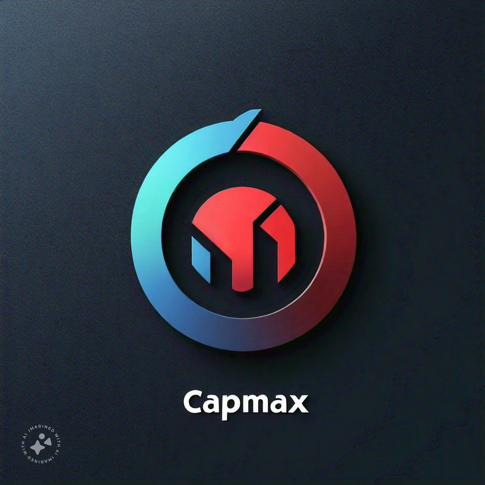

# CapMax

CapMax is a web application that allows users to upload images and processes them to extract text using Optical Character Recognition (OCR). The application provides a simple interface for users to preview the uploaded image and view the extracted text along with additional processing information.

## Features

- **Image Upload:** Users can upload images in JPEG, PNG, and JPG formats.
- **Image Preview:** Displays a preview of the uploaded image before submission.
- **OCR Processing:** Extracts text from the uploaded image using Tesseract OCR.
- **Results Display:** Shows the extracted text and processing details on the same page.

## Technologies Used

- **FastAPI:** Web framework for building APIs.
- **Python:** Programming language used for backend development.
- **Pillow (PIL):** Python Imaging Library for image processing.
- **Tesseract OCR:** Open-source OCR engine used for text extraction.
- **JavaScript:** Used for handling image preview and form submission.
- **HTML/CSS:** Used for creating the user interface.

## Setup and Installation

1. **Clone the Repository:**

   ```bash
   git clone <repository-url>
   cd CapMax
   sudo apt install tesseract-ocr 
   ```

2. **Create a Virtual Environment:**

   ```bash
   python -m venv .venv
   ```

3. **Activate the Virtual Environment:**

   On Windows:

   ```bash
   .venv\Scripts\activate
   ```

   On macOS/Linux:

   ```bash
   source .venv/bin/activate
   ```

4. **Install Dependencies:**

   ```bash
   pip install -r requirements.txt
   ```

5. **Install Tesseract OCR:**

   Follow the installation instructions for your operating system from the [Tesseract GitHub repository](https://github.com/tesseract-ocr/tesseract).

6. **Run the Application:**

   ```bash
   uvicorn main:app --reload
   ```

   The application will be accessible at `http://127.0.0.1:8000`.

## License

This project is licensed under the MIT License - see the [LICENSE](LICENSE) file for details.
```

### Explanation

- **Application Description:** Briefly explains what CapMax does.
- **Features:** Lists the features of the application.
- **Technologies Used:** Specifies the technologies and tools used in the project.
- **Setup and Installation:** Provides instructions for setting up and running the application.
- **Application Icon:** Displays the icon of the application.
- **License:** Includes a placeholder for licensing information.

Make sure to replace `<repository-url>` with the actual URL of your repository if you're sharing this README online.