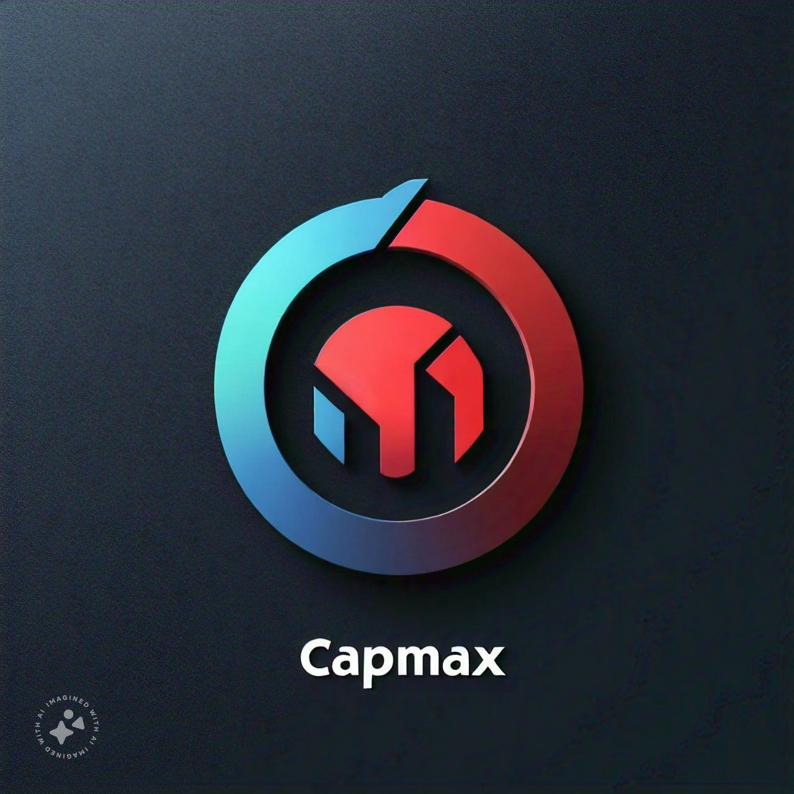

# CapMax

CapMax is a web application that allows users to upload images and processes them to extract text using Optical Character Recognition (OCR). The application provides a simple interface for users to preview the uploaded image and view the extracted text along with additional processing information.

## Features

- **Image Upload:** Users can upload images in JPEG, PNG, and JPG formats.
- **Image Preview:** Displays a preview of the uploaded image before submission.
- **OCR Processing:** Extracts text from the uploaded image using Google Vision OCR.
- **Results Display:** Shows the extracted text and processing details on the same page.

## Technologies Used

- **FastAPI:** Web framework for building APIs.
- **Python:** Programming language used for backend development.
- **Pillow (PIL):** Python Imaging Library for image processing.
- **Google Vision OCR:** Propietary OCR engine used for text extraction.
- **JavaScript:** Used for handling image preview and form submission.
- **HTML/CSS:** Used for creating the user interface.

## Setup and Installation

1. **Clone the Repository:**

   ```bash
   git clone <repository-url>
   cd CapMax
   ```

2. **Create a Virtual Environment:**

   ```bash
   python -m venv .venv
   ```

3. **Activate the Virtual Environment:**


   ```bash
   # On Windows:
   .venv\Scripts\activate

   # On macOS/Linux:
   source .venv/bin/activate
   ```

4. **Install Dependencies:**

   ```bash
   pip install -r requirements.txt
   ```

5. **Keys and Credentials** `.env`

   ```bash
   # .env 'file'
   GOOGLE_CLOUD_CREDENTIALS='google_ccredentials_vision_api.json'

   # DEVELOP OR PRODUCTION
   DEBUG=false
   ``` 

6. **Run the Application:**

   ```bash
   uvicorn main:app --reload --host 0.0.0.0
   ```

   The application will be accessible at `http://127.0.0.1:8000`.


#  Use

## Endpoint Documentation

### `/photo/`

**Method:** POST  
**Description:** Upload a photo and receive processed information.

### Request

- **Headers:**
  - `Accept: application/json`
  - `Content-Type: multipart/form-data`
- **Body:**
  - `file` (required): The image file to upload. It should be in binary format.
  - `ia` (optional): Select if you want recognise with OPENAI or Regular Expression
  - `deposit` (required) If you want recognise and get the data from deposit document

### Curl Example

```bash
curl -X POST \
  'http://127.0.0.1:8000/photo/' \
  -H 'Accept: application/json' \
  -H 'Content-Type: multipart/form-data' \
  -F 'file=@path/to/your/image.jpg;type=image/jpeg' \
  -F 'ia=true' \
  -F 'deposit=false'
```

## Responses

### **200 OK: Invoice Data**
  - **Description:** Successful response with the processed data.
  - **Content:**
    ```json
    {
      "title": "test_12.jpg",
      "response": true,
      "process": {
        "rucs": {
          "vendor": "1600803199001",
          "client": "1600312001001"
        },
        "dates": [
          "22/08/2023"
        ],
        "total_value": [
          18.75
        ],
        "factura_auth": [
          "1131483094"
        ],
        "factura_n": [
          "0002427"
        ]
      }
    }
    ```
### **200 OK: Deposit Data**
  - **Description:** Successful response with the processed data.
  - **Content:**
    ```json
    {
      "title":"deposit_0.jpeg",
      "response":true,
      "process": {
        "amount":"$100.00",
        "receipt_number":"204269016",
        "destination_account":"2670"
      }
    }                                                                  
    ```
